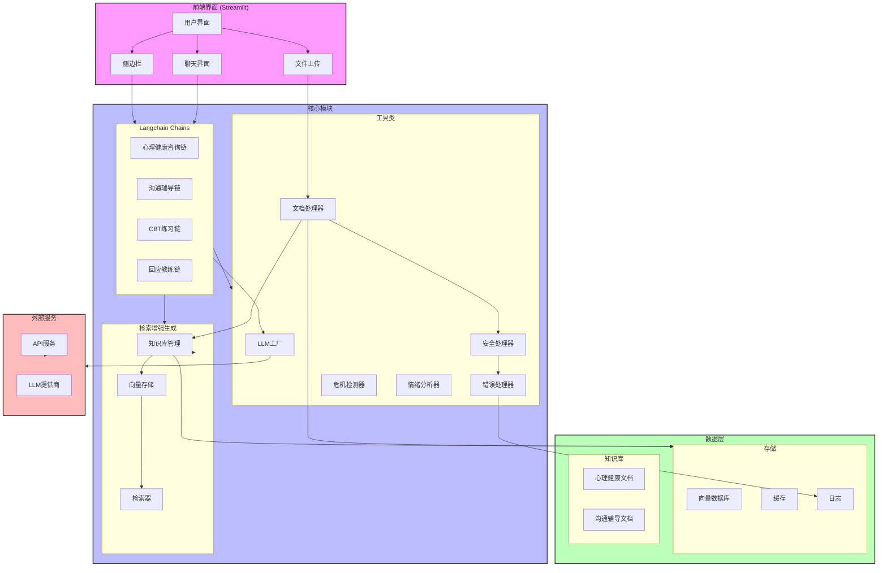
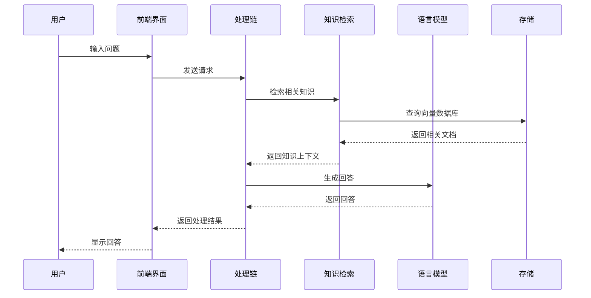
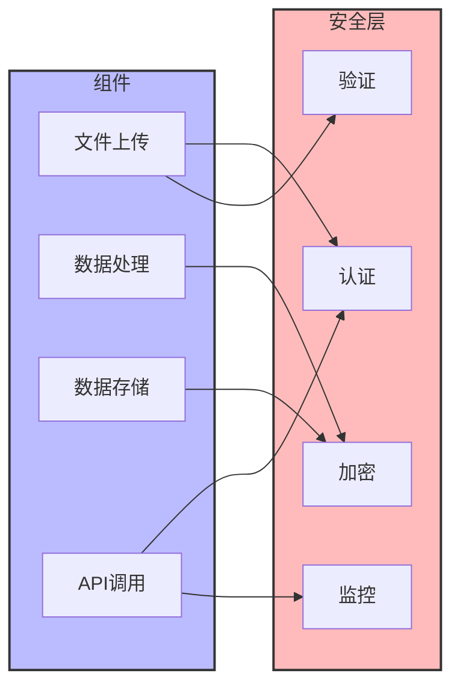

# LumiMind 项目架构

## 系统架构图

## 组件说明

### 前端界面 (Streamlit)
- **用户界面**: 主界面布局和交互
- **侧边栏**: 模块选择、模型选择、文件上传
- **聊天界面**: 对话交互区域
- **文件上传**: 文档上传和管理

### 核心模块
#### Langchain Chains
- **心理健康咨询链**: 处理心理健康相关咨询
- **沟通辅导链**: 处理沟通技巧辅导
- **CBT练习链**: 认知行为疗法练习
- **回应教练链**: 沟通回应建议

#### 检索增强生成 (RAG)
- **知识库管理**: 管理文档和知识
- **向量存储**: 存储文档向量
- **检索器**: 检索相关文档

#### 工具类
- **LLM工厂**: 管理不同LLM提供商
- **文档处理器**: 处理上传文档
- **安全处理器**: 安全检查
- **错误处理器**: 错误处理
- **危机检测器**: 检测危机信号
- **情绪分析器**: 分析用户情绪

### 数据层
#### 存储
- **向量数据库**: 存储文档向量
- **缓存**: 缓存数据
- **日志**: 系统日志

#### 知识库
- **心理健康文档**: 心理健康知识
- **沟通辅导文档**: 沟通技巧知识

### 外部服务
- **LLM提供商**: 各种语言模型服务
- **API服务**: 外部API集成

## 数据流

## 安全架构

